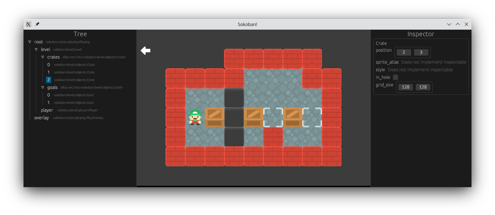

# guiedit
`guiedit` is a Rust library for easily adding a developer GUI to any graphical application.

## Current State
The crate is in a really experimental state right now. Although it is usable, things may change at
any point. The tree node and inspector are already implemented, but the only backend supported is
SFML. If you use SFML, feel free to include this crate, but expect to see many breaking changes down
the line.

Any issue reports & PRs are greatly appreciated!

## Goal
The goal of this crate is to be able to change a few lines of code in an existing or new codebase
and instantly get an editor viewport, an object inspector, graphical gizmos, and even state
loading/saving & hot code reloading. You can read further details on the "Progress" section below.

## Tutorial
TODO; Check examples for now

## Progress
| Symbol | Meaning |
| ------ | ------- |
| ✅     | Done; implemented |
| ☑️      | Partial implementation |
| 🚧     | Work-in-progress  |
| ⌛     | Planned; Queued   |

### Editor & Common Features
|   Feature     |   Status  |
| ------------- | --------- |
| Inspector with support for `Inspectable` objects | ✅ |
| `#[derive(Inspectable)]` for structs | ✅ |
| `#[derive(Inspectable)]` for enums | ✅ |
| Object tree with support for `TreeNode` objects | ✅ |
| `#[derive(TreeNode)]` for structs | ✅ |
| `#[derive(TreeNode)]` for enums | ⌛ |
| `Inspectable` impl for std & core types | ☑️🚧 |
| `TreeNode` impl for std & core types | ☑️🚧 |
| Hot code reloading | ⌛ |
| Graphical gizmo support | ⌛ |

### [`sfml`](https://github.com/jeremyletang/rust-sfml) Integration
|   Feature     |   Status  |
| ------------- | --------- |
| Forwarding all user rendering to offscreen texture | ✅ |
| Capturing events from the editor and relaying them to user-side | ☑️ |
| Object inspection via UI | ✅ |
| Window resizing | ⌛ |
| `Inspectable` impl for SFML types | ☑️🚧 |
| Graphical gizmos for `Drawable`s | ⌛ |

